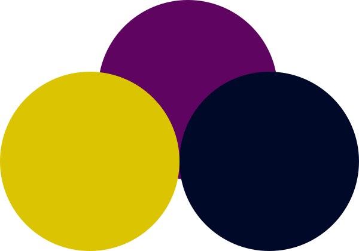
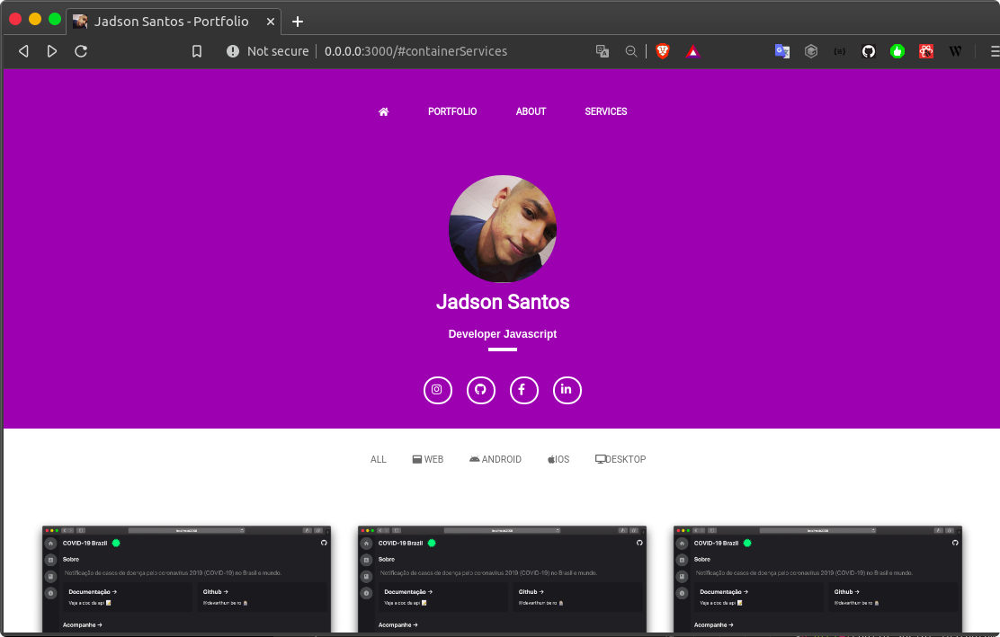

<p align="center">

</p>

<p align="center">
PORTFOLIO 
</p>


**Chat: __[WhatsApp](https://api.whatsapp.com/send?phone=5548999328092)**


## [Demo](https://jadsonsantos.com)

website de divulção do projeto mostrando.

<div align="center">
  <br>
    
  <br>
</div>

## Funcionalidades 

- Notificação 🔔


## Motivo 🤔

Fornecer uma ambiente simples para estruturar seus `projetos`, `serviços` e `contatos` de uma forma profissional.

## Ambiente de desenvolvimento 🚀


Clonando o projeto:

```
git clone https://github.com/jadson179/portfolio.git
```

Navegando até a pasta do projeto:

```
cd portfolio/
```

Baixando as dependências do projeto

```bash
yarn or npm install 
```

Rodando o projeto como dev

```bash
yarn start ou npm run start 
```

Criando build podução

```
  yarn deploy para postar no seu github

```

Acesse [http://localhost:3000](http://localhost:3000) com o seu navegador para ver o resultado.

# Configuração 

navegue até src/Utils/config.js, nesse arquivo terá o um objeto de configuração que aponta para alguns recursos da pagina.

**Exemplo**: estrutura do objeto

```js
{  
    projects: {
        __all: [
            {
                img: "URL IMAGEM DO PROJETO",
                url: "URL PROJETO"
            }
            
        ],
        __web: [
            {
                img: "URL IMAGEM DO PROJETOS WEBS",
                url: "URL PROJETO WEB"
            }
        ],
        __android: [
            {
                img: "URL IMAGEM DO PROJETOS MOBILE ANDROID",
                url: "URL PROJETOS MOBILE ANDROID"
            }
        ],
        __ios: [
          {
                img: "URL IMAGEM DO PROJETOS MOBILE IOS",
                url: "URL PROJETOS MOBILE IOS"
            }
        ],
        __desktop: [
           {
                img: "URL IMAGEM DO PROJETOS DESKTOP",
                url: "URL PROJETOS DESKTOP"
            }
        ]
    },
    services: [
        { icon: 'NOME DA CLASSE https://fontawesome.com/', title: "NOME SERVIÇO",  description: "DESCRIÇÃO DO SERVIÇO"},
        { icon: 'NOME DA CLASSE https://fontawesome.com/', title: "NOME SERVIÇO" , description: "DESCRIÇÃO DO SERVIÇO"},
        { icon: 'NOME DA CLASSE https://fontawesome.com/', title: "NOME SERVIÇO" , description: "DESCRIÇÃO DO SERVIÇO"},
        { icon: 'NOME DA CLASSE https://fontawesome.com/', title: "NOME SERVIÇO" , description: "DESCRIÇÃO DO SERVIÇO"},
        { icon: 'NOME DA CLASSE https://fontawesome.com/', title: "NOME SERVIÇO" , description: "DESCRIÇÃO DO SERVIÇO"},
        { icon: 'NOME DA CLASSE https://fontawesome.com/', title: "NOME SERVIÇO" , description: "DESCRIÇÃO DO SERVIÇO"},

    ],
    about: {
        works: [
            { company: "NOME DA EMPRESA", role: "NOME DO CARGO", initYear: "DATA DE INICIO", exitYear: "DATA FIM" },
            { company: "NOME DA EMPRESA", role: "NOME DO CARGO", initYear: "DATA DE INICIO", exitYear: "DATA FIM" },
            { company: "NOME DA EMPRESA", role: "NNOME DO CARGO", initYear: "DATA DE INICIO", exitYear: "DATA FIM" },
        ],
        scholl: [
            { company: "NOME DA ESCOLA", course: "NOME DO CURSO", initYear: "DATA DE INICIO", exitYear: "DATA FIM"  },
            { company: "NOME DA ESCOLA", course: "NOME DO CURSO", initYear: "DATA DE INICIO", exitYear: "DATA FIM"  },
            { company: "NOME DA ESCOLA", course: "NOME DO CURSO", initYear: "DATA DE INICIO", exitYear: "DATA FIM"  }
        ],
        description: {
            text: `
            DECRIÇÃO SOBRE VOCÊ
            `
        }
    },
    social: {
        instagram: "URL INSTAGRAM",
        github: "URL GITHUB",
        facebook: "URL FACEBOOK",
        linkegin: "URL LINKEDIN",
    },
    person: {
        img: "URL DA IMAGEM DA HOME",
        role: "CARGO ATUAL",
        icon: "URL DO FAVICON",
        name: "SEU NOME"
    },
    platforms: {
      zapier: {
          url: "URL WEBHOOK ZAPIER",
      }
    }
}

```


## Licença 📝

Esse projeto usa a licença MIT license - veja o arquivo LICENSE para mais detalhes

## Ajude o projeto 🤝

[paypal](https://www.paypal.com/cgi-bin/webscr?cmd=_donations&business=TQ2QEYCNZNH7C&currency_code=BRL&source=url)

## Autor
<table>
  <tr>
    <td align="center"><a href="https://github.com/jasdson179"><br /><sub><b>Jadson Santos</b></sub></a><br /><a href="https://github.com/jadson179/portfolio/commits?author=jadson179" title="Code">💻</a> <a href="#devarthurribeiro" title="Design">🎨</a></td>
  <tr>
</table>
